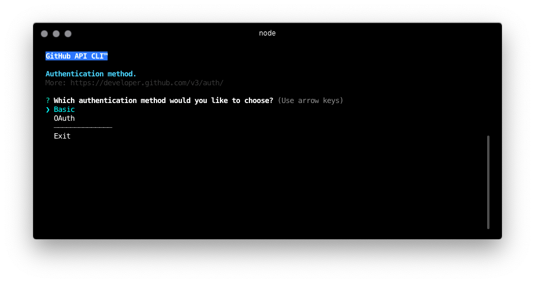

# <span style="font-variant: small-caps">viae™</span> :octocat:
> Intuitive and fast solution to manipulate GitHub's REST API :tada: 

<span style="font-variant: small-caps">viae™</span> is a __GitHub API Command Line Interface__ which was build on the top of [Node.js][Node.js Homepage] and looks wonderfully in [Hyper™][Hyper Homepage] from [ZEIT, Inc.][Zeit, Inc.] This simple CLI has been designed to make your life easier, to look astonishing and has its educational reason too, Dummies :black_heart: :monkey:



## Table of Contents

1. [Overview](#viae™)
2. [Code of Conduct](#code-of-conduct)
3. [Install](#install)
4. [Contribution](#contribution)
	• [To do](#to-do)
	• [Development](#development)
5. [Credits](#credits)

## ~~Install~~
> Soon!

For now it would be better if you go to [Development][Development] and run it in `--dev` mode.

## Contribution
> Contributors: feel welcome!

### [Code of Conduct][Contributors Guide]
> Not on my watch!

Please: before you'll make your first `Pull Request` make sure that you fully understand and agree Code of Conduct. In the world which we're living now it's crucial for me (and I hope to future society around my projects) that everyoneż will **respect** the others. Thank you!

### To do:
- [ ] write innner documentation like so `--help, -h`
- [ ] build homepage
- [ ] explain CRUD: `Create/Read/Update/Delete`
- [ ] add [npm][npm] package
- [ ] add HTTP Verbs: `GET/POST/PUT/DELETE`

### Development
Clone repository via `git clone` and install all Dependencies in downloaded `viae` root folder — use your favorite package manager.

```shell
git clone https://github.com/robertgrzonka/viae
cd viae
yarn
```
> Change yarn to `npm install` if you'd like.

For more info please go [here][Contributors Guide].

---
<div style="text-align: center; font-variant: small-caps">

[](https://forthebadge.com)
[theguys™][theguys] represented by [robertgrzonka][robertgrzonka] © 2018

</div>

[ZEIT, Inc.]: https://zeit.co
[Contributors Guide]: CONTRIBUTING.md
[Node.js Homepage]: https://nodejs.org
[Hyper Homepage]: https://hyper.is
[npm]: https://npmjs.com
[Development]: #Development
[theGuys]: https://github.com/theguysdesign
[robertgrzonka]: robert@theguys.sh
